# RemoteDiariJoan
## 1 – Creació d’una pàgina Web utilitzant eines Git i Github

1. Creo un directori de treball anomenat /DiariVostreNom/ en el directori de l'usuari.

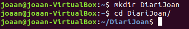

2. Inicialitzar el repositori buit.

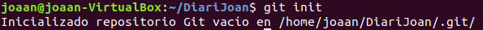

3. Crear l'arxiu index.html.

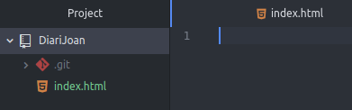

4. Afegir l'estructura bàsica.

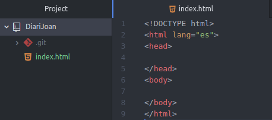

5. Crear un commit indicant que es crea l'esquelet bàsic del index.html

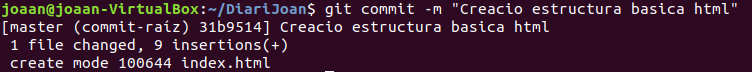

6. Afegir el contingut al head, entre \<head> i <\/head>.

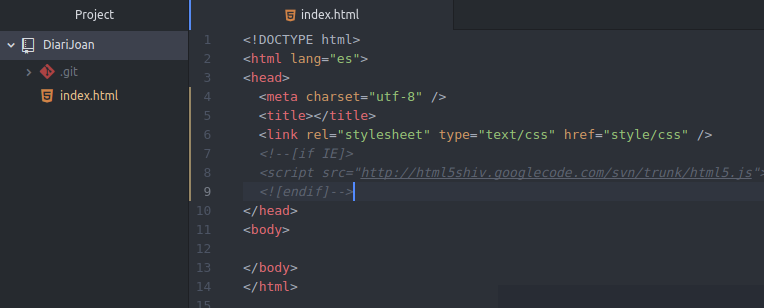

7. Crear un commit indicant que s'afegeix la capçalera del index.html

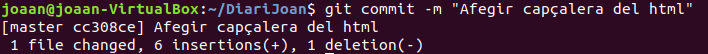

8. Afegir el contingut al body, entre \<body> i <\/body>

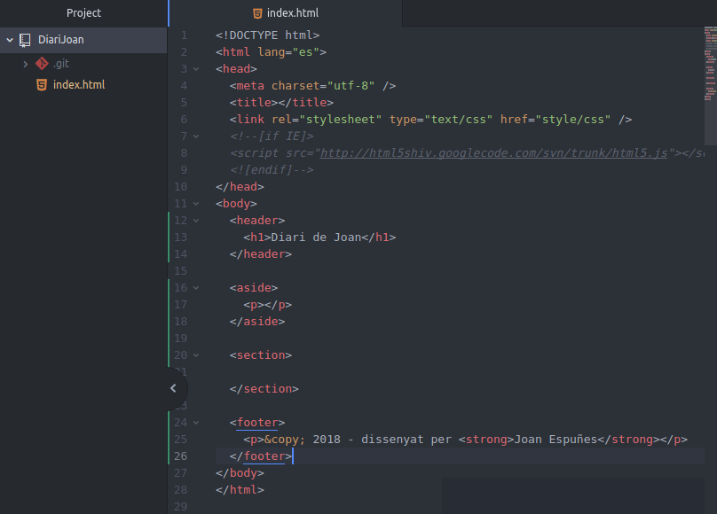

9. Crear un commit indicant que s'afegeix l'estructura bàsica del body.

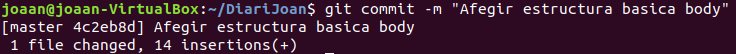

10. Crear un repositori en GitHub que s’anomeni RemoteDiariVostreNom

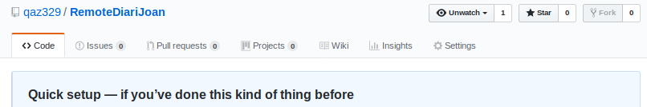

11. Assignar al vostre repostiorio global el remot

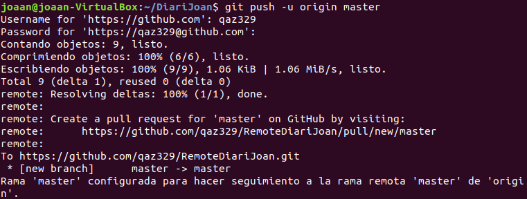

12. Afegir el contingut de section, entre <section> i </section> ( la idea és afegir al menys tres posts en la zona d’articles del vostre document). Podeu afegir notícies, articles etc...

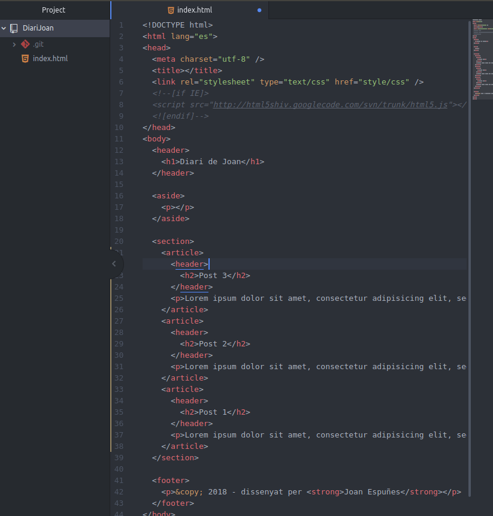

13. Crear un commit indicant que s'afegeix tota l'estructura de la zona de posts.

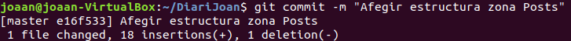

14. Crear un arxiu style.css.

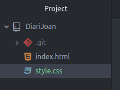

15. Afegir la següent informació.

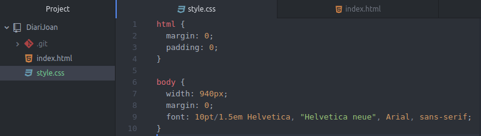

16. Crear un commit indicant que s'afegeixen les CSS d'html i de body.

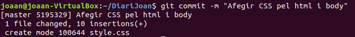

17. Afegir la següent informació.

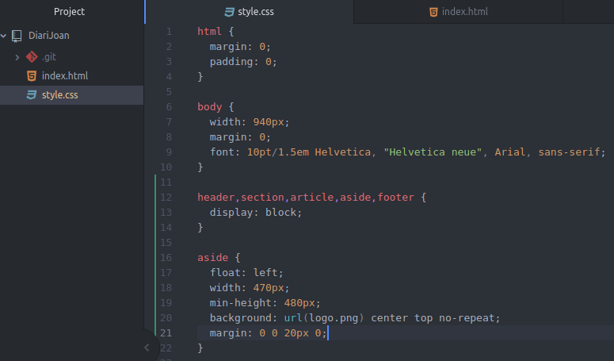

18. Crear un commit indicant que s'afegeixen les CSS de diversos elements HTML5: header, section, article, aside i footer.

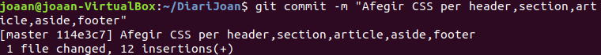

19. Afegir en el directori arrel de projecte el logotip que apareixerà en la barra lateral esquerra: logo.png ( podeu ficar la imatge que vulgueu)

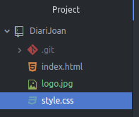

20. Crear un commit indicant que s'afegeix el logotip del Vostre Diari.

21. Afegir la següent informació.

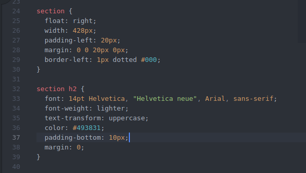

22. Crear un commit indicant que s'afegeixen les CSS de section.

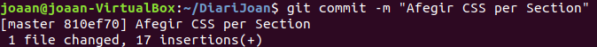

23. Afegir la següent informació.

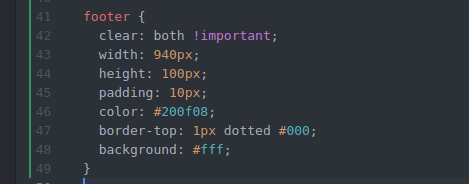

24. Crear un commit indicant que s'afegeixen les CSS del footer.

25. Afegir la següent informació.

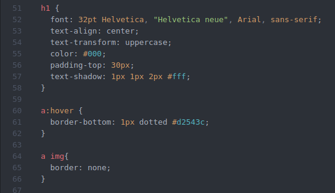

26. Crear un commit indicant que s'afegeixen les CSS de l'H1 i dels enllaços.

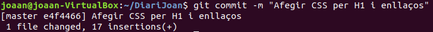

27. Actualitzar la pàgina remota de forma regular fent amb l'ordre push. 
git push [nom-remot][nomeni-branca] ( és possible que tingueu que pujar mes d'una branca en algun moment de la practica)

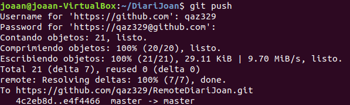

28. Crear una etiqueta de v1.0

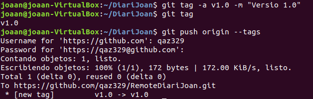

29. Crear una branca “develop”.

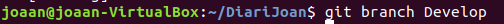

30. En aquesta branca de desenvolupament anem a realitzar diverses tasques:
31. Crear un directori de images i moure allí el logotip logo.png.

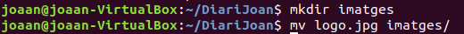

32. Crear un commit indicant que es mou el logotip a la carpeta images.

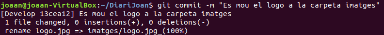

33. Crear un directori de CSS i moure allí les CSS style.css.

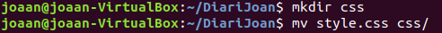

34. Crear un commit indicant que es mou la CSS a la carpeta CSS.

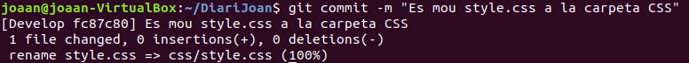

35. Canviar les referències a la CSS en el index.htm i al logotip logo.png en la CSS.

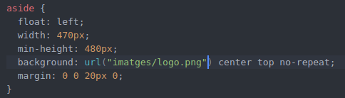

36. Crear un commit indicant que es canvien les referències a les CSS i a les imatges al reorganitzar-les en directoris.

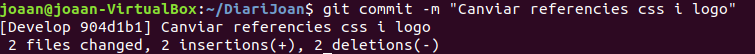

37. Actualitzar la pàgina remota de forma regular fent amb l'ordre push.

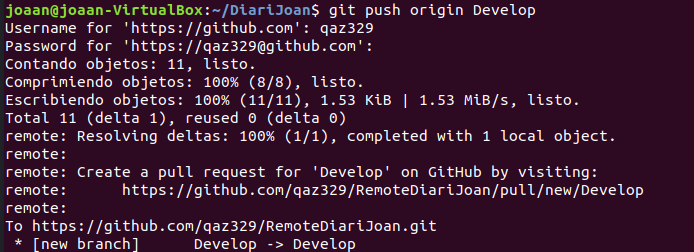

38. Anar al vostre repositori en Github.com i comprovar que ho teniu idèntic al vostre repositori local.

### A GITHUB.COM:
39. Crear una branca “bugfix” a partir de la “master” per resoldre una sèrie de modificacions.

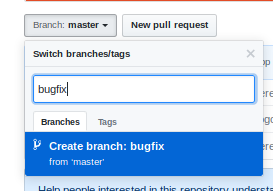

40. Treure els comentaris en les CSS de les dues vores (comencen per //border ).

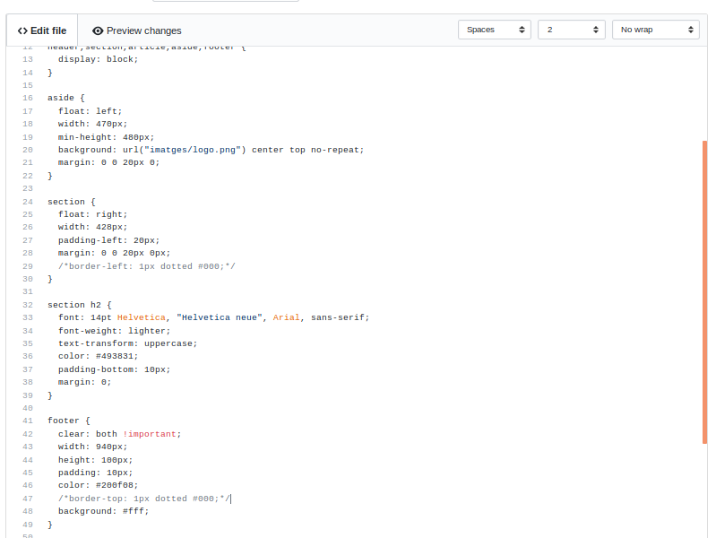

41. Crear un commit indicant que introdueixen les vores en la barra dreta i en el footer.

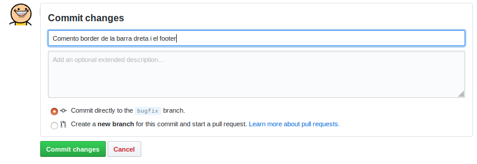

42. Introduir com a títol “Diari de Vostre Nom”.

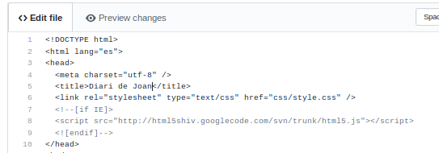

43. Crear un commit indicant que s'introdueix el títol a la pàgina.

44. Canviar 2012 per 2018 en el footer. Treure (c).

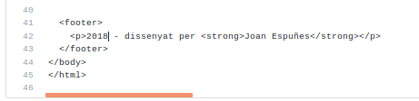

45. Crear un commit indicant que es realitzen petits ajustos en el footer.

46. Crear una etiqueta de v1.1

47. Portar aquests canvis a la branca “master” ( realitzar un merge).

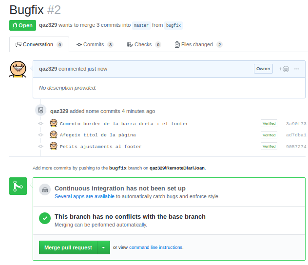

48. Esborrar la branca “bugfix”.

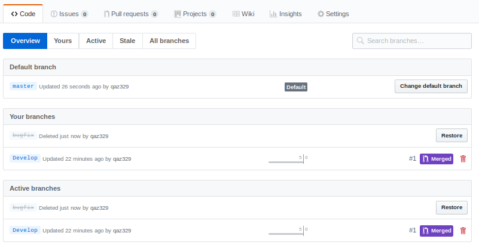
